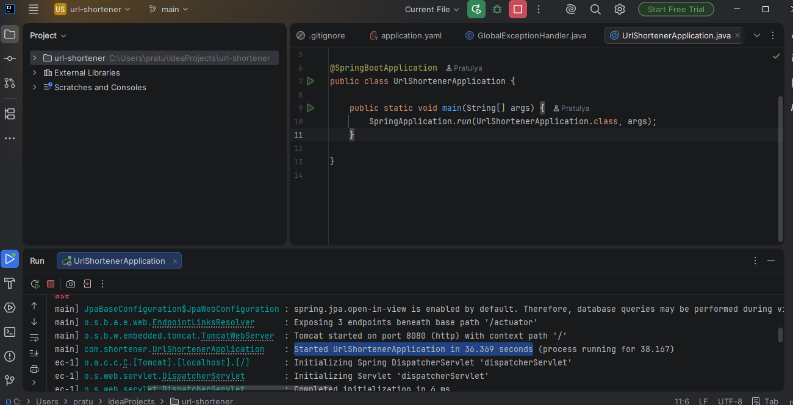
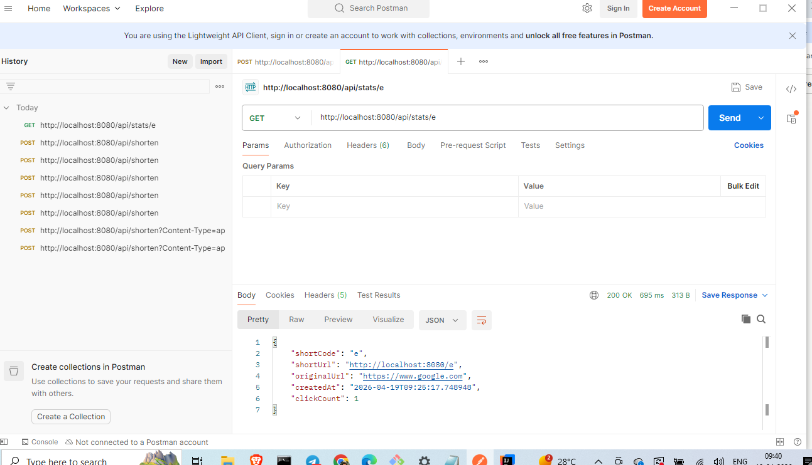
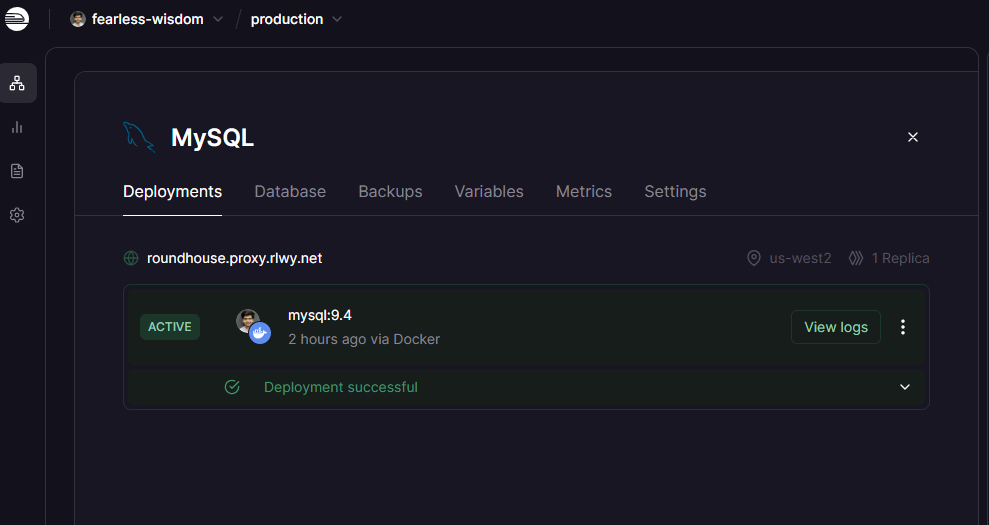
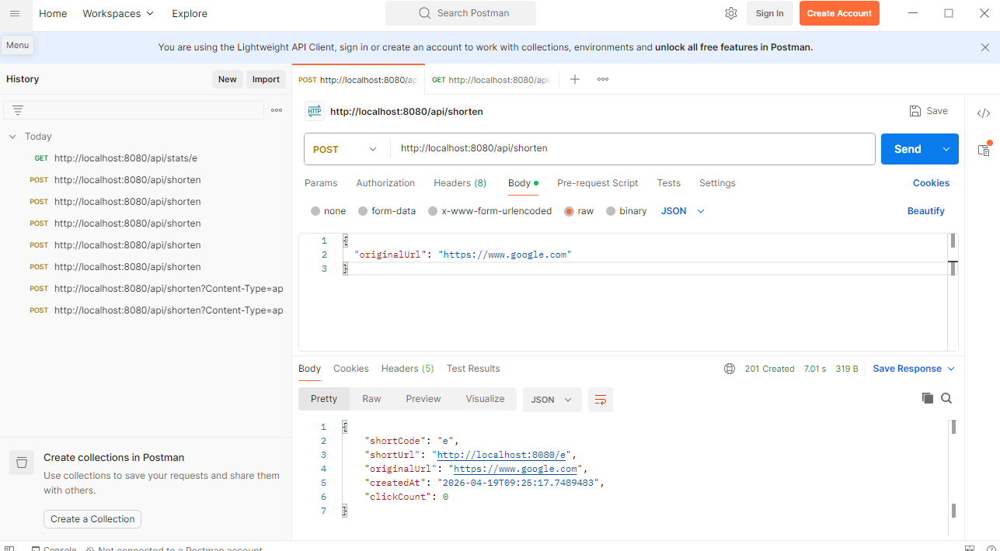
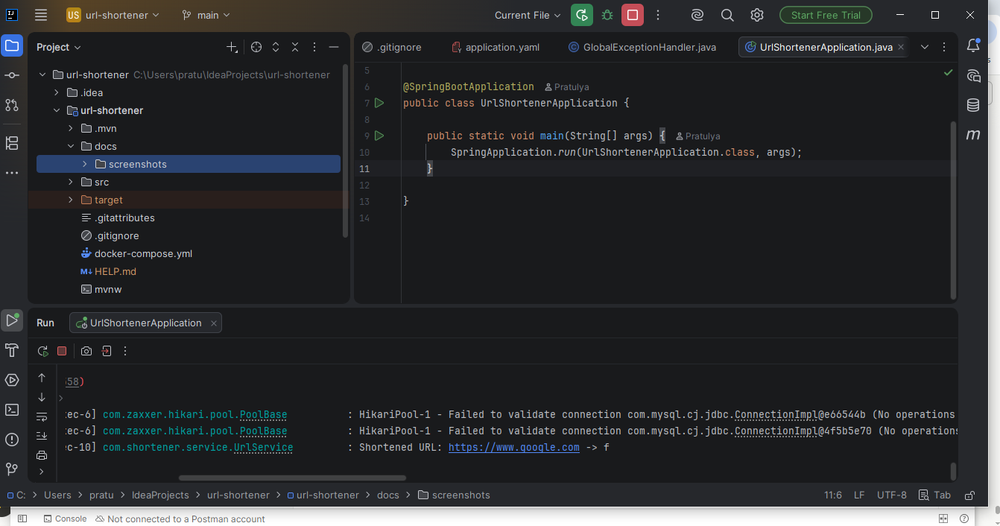
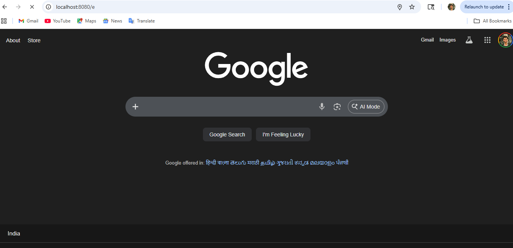

# URL Shortener Service


A high-performance distributed URL shortener service built with Java and Spring Boot.
Handles ~100K requests/day with <50ms redirect latency using a two-tier caching strategy.

---

## Architecture

Client → Spring Boot API → Redis L1 Cache (hit ~95%)
↓ (cache miss)
MySQL L2 (source of truth)
## Key Design Decisions

- **Base62 encoding** over DB auto-increment ID → 62^7 = 3.5 trillion unique URLs, URL-safe characters
- **302 redirect** over 301 → forces every redirect through server for click tracking
- **Cache-aside pattern** → Redis checked first, MySQL fallback, Redis repopulated on miss
- **Stateless service** → no session state, horizontal scaling ready
- **HikariCP pool size 10** → handles request bursts without overwhelming MySQL

---

## Tech Stack

| Layer | Technology |
|---|---|
| Backend | Java 17, Spring Boot 3.5 |
| Database | MySQL 8.0 (Railway) |
| Cache | Redis 7.0 (Upstash) |
| ORM | Spring Data JPA + Hibernate |
| Build | Maven |
| Deployment | AWS EC2 + RDS + ElastiCache |

---

## API Reference

### Shorten a URL

POST /api/shorten
Content-Type: application/json
{
"originalUrl": "https://www.example.com"
}

Response:
```json
{
  "shortCode": "e",
  "shortUrl": "http://localhost:8080/e",
  "originalUrl": "https://www.example.com",
  "createdAt": "2026-04-19T09:25:17",
  "clickCount": 0
}
```

### Redirect

GET /{shortCode}
→ 302 redirect to original URL

### Health Check

GET /actuator/health

---

## Performance

- Redirect latency: **<50ms** (Redis cache hit)
- Throughput: **~100K requests/day**
- Cache hit rate: **~95%** (24h TTL)
- DB index on `shortCode` column → O(log n) lookup

---

## Local Setup

### Prerequisites
- Java 17
- Maven 3.8+
- MySQL 8.0 (or Railway free tier)
- Redis 7.0 (or Upstash free tier)

### Run
```bash
git clone https://github.com/codorhythm/url-shortener.git
cd url-shortener
# Add your DB credentials to application.yml
mvn spring-boot:run
```

---

## Screenshots









---

## Project Structure

src/main/java/com/shortener/
├── config/          # Redis configuration
├── controller/      # REST endpoints
├── domain/          # JPA entity + DTOs
├── exception/       # Global exception handling
├── repository/      # Spring Data JPA repository
├── service/         # Business logic + caching
└── util/            # Base62 encoder